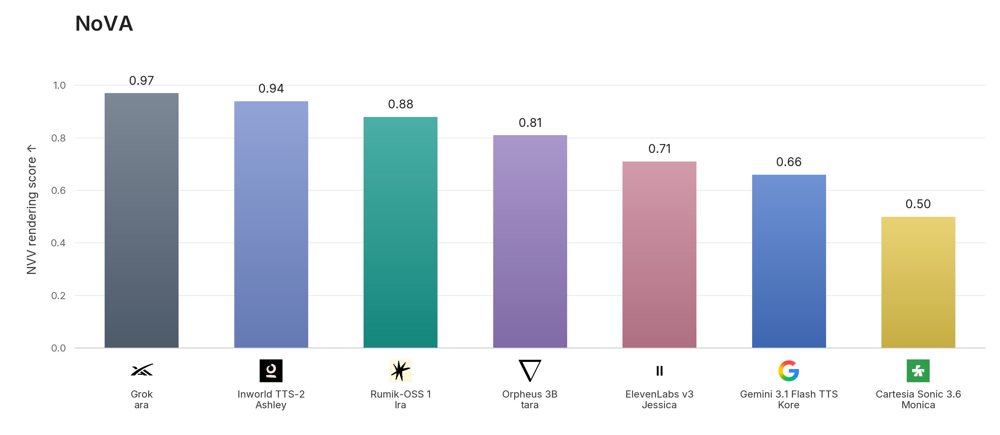
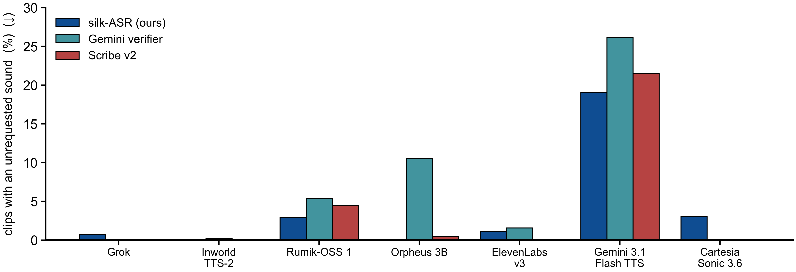
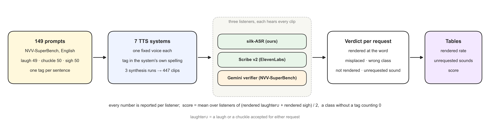
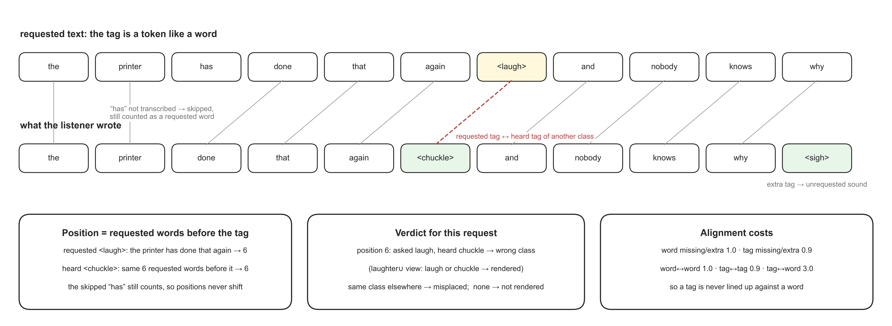

# NoVA Benchmark

[Benchmark inputs](benchmark/prompts.jsonl) · [Methodology](METHODOLOGY.md) · [Verifier prompt](evaluation/prompts/nvv_superbench_verifier_v1.txt) · [Generation configurations](generation_recipes.json)

NoVA (Non-Verbal Vocalization Alignment) evaluates whether a text-to-speech system renders the non-verbal vocalization it is asked for, at the word it is asked for, and nothing else. The task is to synthesize a transcript that contains one inline tag, a laugh, a chuckle or a sigh, placed at a specific word.

The published experiment comprises 149 prompts and 2,979 recordings from seven TTS configurations, each prompt synthesized three times. Three automatic listeners judge every recording independently, and every number is reported per listener. This repository provides the prompts, the per-system tag spellings, frozen generation configurations, the per-recording judgments of all three listeners, result tables, and the scoring code. Generated recordings are not bundled. Score reproduction works offline; judging new recordings requires your own provider access.

## Motivation

Our evaluation question is specific: **when a TTS system is given `[laugh]` in the middle of a sentence, does a laugh occur, does it occur there, and does the system add sounds nobody asked for?** Expressive TTS products expose these tags as a control surface, yet whether the control works is rarely measured beyond "a laugh is somewhere in the clip".

[NVV-SuperBench](https://arxiv.org/abs/2604.16211) (Xue et al., Interspeech 2026) is the closest reference. It benchmarks 15 systems over a 45-type taxonomy in English and Chinese, judging each clip with a Gemini verifier that is told which tag to look for and accepts a match within two words of the requested position. We take its English laugh, chuckle and sigh prompts verbatim and its verifier protocol unchanged, and adapt the evaluation around three requirements:

1. **More than one listener.** A single automatic judge that is told what to find is an upper bound, not a measurement. NoVA adds two listeners that are not told anything, an in-house speech recognizer that writes tags inline, and a commercial speech-to-text service with audio-event tagging, and reports all three side by side. Where they disagree, the disagreement is the result.
2. **Exact placement.** A request counts only if the sound occurs at the requested word. Positions are counted in the words of the requested text, so a transcription error cannot move them.
3. **Unrequested sounds as a first-class number.** Sounds the system adds on its own are reported as the share of clips that contain one, per listener, rather than folded into an F1.

NoVA measures tag-following for laughter and sighs. It does not measure speech quality, naturalness, emotion, or any other non-verbal type. The [methodology](METHODOLOGY.md) documents the scoring rules and the equations.

## Results

Scores are the fraction of requests rendered at the requested word, 0–1, higher is better.



**Table 1. Rendered at the requested word**, mean of three synthesis runs, per listener. laughter∪ = a laugh or a chuckle accepted for either request. Tags = tags the system accepts (L laugh, C chuckle, S sigh). Bold = best per column. "n/a" = the system has no tag for that class.

| System | Tags | silk-ASR laughter∪ | silk-ASR sigh | Gemini verifier laughter∪ | Gemini verifier sigh | Scribe v2 laughter∪ | Scribe v2 sigh | Score |
| --- | --- | ---: | ---: | ---: | ---: | ---: | ---: | ---: |
| Grok (ara) | L·C·S | 1.00 | **1.00** | **1.00** | 0.99 | **1.00** | 0.84 | **0.97** |
| Inworld TTS-2 (Ashley) | L·C·S | **1.00** | 0.99 | **1.00** | **1.00** | 0.98 | 0.68 | **0.94** |
| Rumik-OSS 1 (Ira) | L·C·S | 0.86 | 0.89 | 0.92 | 0.96 | 0.87 | 0.80 | **0.88** |
| Orpheus 3B (tara) | L·C·S | 0.52 | 0.95 | 0.81 | 0.99 | 0.67 | **0.93** | **0.81** |
| ElevenLabs v3 (Jessica) | L·C·S | 0.40 | 0.86 | 0.83 | 0.97 | 0.33 | 0.84 | **0.71** |
| Gemini 3.1 Flash TTS (Kore) | L·C·S | 0.70 | 0.71 | 0.67 | 0.51 | 0.81 | 0.59 | **0.66** |
| Cartesia Sonic 3.6 (Monica) | L | 0.99 | n/a | 1.00 | n/a | 1.00 | n/a | **0.50** |

**Table 2. Clips containing a sound nobody asked for.** Share of a system's clips in which the listener heard a laugh, chuckle or sigh that was not the one requested; lower is better.

| System | silk-ASR | Gemini verifier | Scribe v2 |
| --- | ---: | ---: | ---: |
| Grok (ara) | 0.7 % | 0.0 % | 0.0 % |
| Inworld TTS-2 (Ashley) | 0.0 % | 0.2 % | 0.0 % |
| Rumik-OSS 1 (Ira) | 2.9 % | 5.4 % | 4.5 % |
| Orpheus 3B (tara) | 0.0 % | 10.5 % | 0.4 % |
| ElevenLabs v3 (Jessica) | 1.1 % | 1.6 % | 0.0 % |
| Gemini 3.1 Flash TTS (Kore) | 19.0 % | 26.2 % | 21.5 % |
| Cartesia Sonic 3.6 (Monica) | 3.0 % | 0.0 % | 0.0 % |

For each listener *d*, `S(d) = (rendered laughter∪ + rendered sigh) / 2`, where a class the system has no tag for counts as 0; `Score = mean of S over the three
    listeners`. Ties are broken by the smaller share of clips with unrequested sounds. A laughter-only system therefore cannot score above 0.5. Cells are means over three synthesis runs of the 149 prompts; the run-to-run standard deviation is at most 0.09 on every cell. The table is rounded from the canonical CSV, which the reproduction command below checks exactly.

Laugh and chuckle are merged into laughter∪ for the main table and the score because the listeners disagree on the split of the same audio: on Grok's laugh requests, silk-ASR hears 0.31 laugh / 0.99 chuckle, Scribe v2 0.97 / 0.51, and the Gemini verifier 1.00 / 1.00. The per-class table is [`benchmark/results/appendix_split.csv`](benchmark/results/appendix_split.csv).



These are automatic judgments of the specified configurations. They are not human ratings and not a measure of speech quality.

### Listener dependence

The three listeners agree on the order of the systems but not on the level, and on one system they tell different stories. ElevenLabs v3's laughter is credited at 0.40 by silk-ASR and 0.33 by Scribe v2, ElevenLabs' own transcription service, but at 0.83 by the Gemini verifier, which is told which tag to look for. The Gemini verifier also reports unrequested sighs in 10.5 % of Orpheus clips that neither transcriber hears. We report every number per listener and treat the conditioned verifier as an upper bound; no score is adjusted.

## How It Works



Each prompt goes to every system in the system's own tag spelling; every recording is heard by all three listeners; each request gets one verdict (rendered at the requested word, misplaced, wrong class, or not rendered), and every heard tag left over counts as an unrequested sound. For the two transcribing listeners, positions are found by a tag-aware alignment of the transcript against the requested text, counted in the words of the requested text so that a transcription error cannot move a position:



The full rules, equations and a worked example are in [METHODOLOGY.md](METHODOLOGY.md).

## Task Coverage

| Dimension | Distribution |
| --- | --- |
| Requested tag | laugh 49, chuckle 50, sigh 50 (149 prompts, one tag each) |
| Sentence length | 11–60 words |
| Language | English |
| Synthesis runs | 3 per prompt per system |

Every system receives the same text with the tag written in the spelling its documentation prescribes:

| System | laugh | chuckle | sigh |
| --- | --- | --- | --- |
| Grok TTS | `[laugh]` | `[chuckle]` | `[sigh]` |
| Inworld TTS-2 | `[laugh]` | `[chuckle]` | `[sigh]` |
| Rumik-OSS 1 | `<laugh>` | `<chuckle>` | `<sigh>` |
| Orpheus 3B | `<laugh>` | `<chuckle>` | `<sigh>` |
| ElevenLabs v3 | `[laughs]` | `[chuckles]` | `[sighs]` |
| Gemini 3.1 Flash TTS | `[laughs]` | `[chuckles]` | `[sighs]` |
| Cartesia Sonic 3.6 | `[laughter]` | `[laughter]` | n/a (no tag) |

One fixed voice per system at documented default settings; ElevenLabs at its Creative stability, which its documentation names for audio tags; Rumik-OSS 1 uses Ira with its emotion descriptor set to *happy* for laugh and chuckle prompts and *sad* for sigh prompts. Cartesia documents a single `[laughter]` tag, used here for both laugh and chuckle requests; its 50 sigh prompts are not sent. The comparison includes voice choice and provider controls; there was no search over voices. Voices and settings are recorded in [`generation_recipes.json`](generation_recipes.json).

## Installation

```bash
git clone https://github.com/ira-rumik/nova-bench.git
cd nova-bench
python -m venv .venv
source .venv/bin/activate
python -m pip install -r requirements.txt
python -m unittest discover -s tests -v
```

Score reproduction and judging run on CPU.

## Reproduce the Published Scores

All scoring inputs are committed under [`benchmark/`](benchmark/). The command below needs no network access, credentials, or audio:

```bash
python aggregate.py --check
```

It rebuilds Tables 1 and 2 and the per-class split from [`benchmark/judgments/`](benchmark/judgments/): 8,937 per-recording records (7 systems × 3 runs × 3 listeners) holding the tags each listener heard with their positions, the verdict for the requested tag, and any unrequested sounds, and compares every value with [`benchmark/results/`](benchmark/results/). The final message begins `PASS:`. This reproduces aggregation, not an independent re-judging of the recordings.

## Listener Configuration

| Listener | Model | Interface | Settings |
| --- | --- | --- | --- |
| silk-ASR | Rumik's in-house speech recognizer, which transcribes speech and writes `<laugh>`, `<chuckle>`, `<sigh>` inline where the sound occurs | local | deterministic decoding, English |
| Scribe v2 | ElevenLabs `scribe_v2` | ElevenLabs speech-to-text API, `tag_audio_events` on | events `[laughs]`/`[laughter]`/`[giggles]` → laugh, `[chuckles]` → chuckle, `[sighs]` → sigh |
| Gemini verifier | `gemini-3.1-pro-preview` | Vertex AI or Gemini API | NVV-SuperBench prompt and JSON schema verbatim, temperature 0 |

**silk-ASR is not released.** On the VocalSound corpus (3,504 speakers) it tags 94.9 % of laughter recordings as laughter and 92.5 % of sigh recordings as sigh. The weights are not released. To get a silk-ASR column for your system, send us the 447 clips and we return the scored records. The per-clip records for all seven systems in this repo (`benchmark/judgments/`) let you recompute every number in the tables without the model. silk-ASR will be offered as a paid API soon.

Credentials are read from environment variables:

```bash
export ELEVENLABS_API_KEY="your-elevenlabs-key"     # Scribe v2
gcloud auth application-default login                 # Gemini verifier via Vertex
export GOOGLE_CLOUD_PROJECT="your-vertex-project"    # or GEMINI_API_KEY
```

Preview models may change or be retired. An unavailable model produces an error without substitution.

## Evaluate a New System

Synthesize the 149 prompts three times with your system, the tag spelled as your system documents it, one `<id>.wav` per prompt (mono, 24 kHz or 16 kHz PCM16), in `runs/<system>/r1`, `r2`, `r3`. Then:

```bash
python prepare.py --system my_tts --runs runs/my_tts          # manifests, coverage of the 149 ids
python judge.py --listener scribe --run runs/my_tts/r1         # paid API calls
python judge.py --listener gemini --run runs/my_tts/r1         # paid API calls
python score.py --run runs/my_tts/r1                           # verdicts from the listener outputs
python aggregate.py --runs runs/my_tts/r1 runs/my_tts/r2 runs/my_tts/r3
```

`judge.py` writes the listener's transcript or verifier response per recording; `score.py` turns them into verdicts using the rules in [METHODOLOGY.md](METHODOLOGY.md); `aggregate.py` prints the two tables and the score for your system beside the published rows. A dry run (`--dry-run`) validates coverage and audio format without API calls. Failed API calls are recorded and never become a low score; unfinished runs exit nonzero.

## Repository Structure

```text
benchmark/
  prompts.jsonl              149 prompts: id, text, text with tag, class, requested word index
  tag_spellings.json         per-system spelling of the three tags
  judgments/<system>/<run>/  per-recording records of the three listeners
  results/                   canonical CSVs (Tables 1–2, per-class split) and LaTeX tables
evaluation/
  align.py                   normalisation, tag-aware alignment, verdicts
  listeners.py               Scribe v2 and Gemini verifier transports
  prompts/                   NVV-SuperBench verifier prompt, verbatim
prepare.py  judge.py  score.py  aggregate.py
generation_recipes.json      voices and settings per system
figs/                        result figures, pipeline and alignment diagrams (build_figures.py)
METHODOLOGY.md               scoring rules, equations, limitations
tests/                       offline checks of the scorer (16 cases)
```

## Scope and Future Work

NoVA v1 covers three tags (laugh, chuckle, sigh) in English, with one voice per system and three synthesis runs. These are the tags that every benchmarked system exposes; the same protocol applies to any tag a system can be asked for, and we intend to extend the set.

## Related Work

Prompts and the verifier protocol come from [NVV-SuperBench](https://github.com/lmxue/NVV-SuperBench). NoVA adds two independent listeners, exact-word placement, and unrequested sounds as a separate measure.

## Citation

```bibtex
@misc{rumik2026nova,
  author       = {{Rumik Intelligence}},
  title        = {{NoVA Benchmark}: Non-Verbal Vocalization Alignment in Tag-Controlled TTS},
  year         = {2026},
  howpublished = {\url{https://github.com/ira-rumik/nova-bench}},
  note         = {Benchmark and evaluation suite, version 1.0.0}
}
```

Please also cite NVV-SuperBench, whose prompts and verifier protocol this benchmark uses:

```bibtex
@inproceedings{xue2026nvvsuperbench,
  title     = {NVV-SuperBench: Beyond Words, Beyond Quality-Benchmarking Nonverbal Vocalizations in Speech Generation},
  author    = {Xue, Liumeng and Bian, Weizhen and Pan, Jiahao and Wu, Wenxuan and Ren, Yilin and Kang, Boyi and others},
  booktitle = {Interspeech},
  year      = {2026},
  url       = {https://arxiv.org/abs/2604.16211}
}
```

## License

Copyright 2026 Rumik Intelligence. Rumik-authored code, documentation, result tables and per-recording judgments in this repository are licensed under the [Apache License 2.0](LICENSE).

The prompts are NVV-SuperBench's and are redistributed here for reproduction with attribution to their authors. The license does not cover generated audio, third-party models or voices, the NVV-SuperBench materials, or company logos; these remain subject to their applicable rights and terms, and the license grants no permission to use any provider's API or to redistribute its outputs. See [NOTICE](NOTICE).
